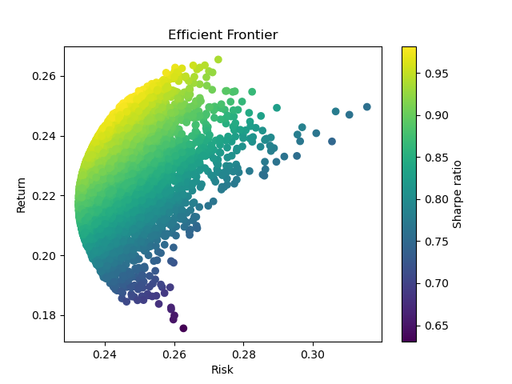

# Monte Carlo Portfolio Optimization

This project provides a web-based interface to perform Monte Carlo simulations for portfolio optimization. 
You can input stock symbols, a date range, and generate an optimized portfolio based on the Monte Carlo method.

## Features

- Fetch historical stock data from Yahoo Finance.
- Calculate annualized returns, standard deviations, and correlation matrix.
- Perform Monte Carlo simulations to generate multiple portfolio scenarios.
- Optimize portfolios to identify the minimum risk and maximum return portfolios.
- Visualize the efficient frontier of the portfolios.
- Generate results in an easy-to-read format with metadata.

## Requirements

- Python 3.x
- Flask
- Pandas
- NumPy
- Matplotlib
- yfinance
- flask_session

## Usage

1. Start the Flask application:
   ```sh
   python app.py
   ```

2. Open your web browser and go to `http://127.0.0.1:5000/`.

3. Enter the stock symbols (space-separated), start date, and end date.

4. Click "Run Simulation" to generate the results.

## Project Structure

```
monte_carlo_portfolio_optimization/
├── .flask_session/                   # Directory for Flask session data
├── templates/                        # Directory for HTML templates
│   ├── index.html                    # Input form for the simulation
│   ├── results.html                  # Results page for the simulation
├── app.py                            # Main Flask application
├── portfolio_results_efficient_frontier.png   # Example output: Efficient frontier plot
├── portfolio_results_simulation_results.csv   # Example output: Simulation results CSV
├── Optimization Results.pdf          # Example output: PDF report of optimization results
└── README.md                         # Project documentation
```

## Example Output

### Optimization Results



Below is an example of the final optimization results displayed in a PDF format with the following input:

- Stocks: ^NSEI ASIANPAINT.BO BERGEPAINT.BO MARICO.BO HDFCBANK.BO AXISBANK.BO PAGEIND.BO ASTRAL.NS
- Start Date: "2010-01-01"
- End Date: "2024-01-01"

